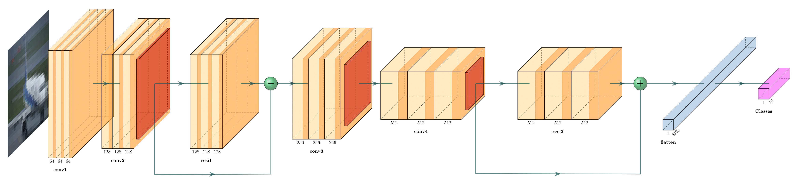

# ImageClassifier

A Residual Neural Network to classify images from the [CIFAR-10](https://www.cs.toronto.edu/~kriz/cifar.html) dataset, using [PyTorch](https://pytorch.org/).

### Results

- Achieved **84.83%** accuracy, when trained for 4 hours
